# Phân tích PP1 cho 2 trạm GNSS 4E và 4W đến bước 6/6

> Script: `step5_pp1_complete.py`  
> Lệnh chạy dùng cho báo cáo này: `python step5_pp1_complete.py --missing-thresh 5 --no-display`  
> Thư mục kết quả: `result/09_pp1_complete/`

---

## 1. Phạm vi và mục tiêu

Tài liệu này cập nhật lại đầy đủ phần **phân cụm PP1 đơn biến và đa biến** dựa trên:

- log bash của lần chạy thực tế
- các file ảnh trong `result/09_pp1_complete/`
- các bảng độ nhạy `C_sensitivity_*.csv`

Phạm vi kết quả được chốt đến **bước 6/6**:

1. tải dữ liệu và thống kê chi tiết
2. ghép mẫu theo giờ
3. tiền xử lý chuỗi
4. chọn số cụm tối ưu
5. phân cụm, phân tích độ nhạy và độ ổn định
6. phân tích đa biến `(X, Y, h)` và tương quan

---

## 2. Quy trình xử lý

### 2.1. Dữ liệu đầu vào

Script đọc hai file GNSS 1 Hz:

- `full_gnss_4e.csv`
- `full_gnss_4w.csv`

Ba trục phân tích đơn biến:

- `X_Coord`
- `Y_Coord`
- `h_Coord`

### 2.2. Pipeline chung

Với từng trục, quy trình thực hiện là:

1. chia dữ liệu thành các cửa sổ 1 giờ
2. loại các giờ có tỷ lệ thiếu vượt `5%`
3. chỉ giữ các giờ chung giữa hai trạm
4. tiền xử lý `Hampel -> reshape_by_window (3600 -> 360) -> Kalman`
5. chuẩn hóa `StandardScaler`
6. giảm chiều `PCA`
7. nhúng `t-SNE` để trực quan hóa và phân cụm
8. chạy `KMeans`, `HAC`, `GMM`, `DBSCAN`
9. đánh giá bằng `Silhouette`, `Calinski-Harabasz`, `Davies-Bouldin`
10. kiểm tra độ nhạy và độ ổn định

### 2.3. Kích thước mẫu sau lọc

Ba trục đều dùng cùng một tập giờ hợp lệ:

| Trục | Missing threshold | 4E trước match | 4W trước match | Giờ chung | 4E sau match | 4W sau match | Sau reshape 4E | Sau reshape 4W | Dữ liệu gộp |
|------|-------------------|---------------:|---------------:|----------:|--------------|--------------|----------------|----------------|------------|
| X_Coord | 5.0% | 238 | 238 | 238 | `(238, 3600)` | `(238, 3600)` | `(238, 360)` | `(238, 360)` | `(476, 360)` |
| Y_Coord | 5.0% | 238 | 238 | 238 | `(238, 3600)` | `(238, 3600)` | `(238, 360)` | `(238, 360)` | `(476, 360)` |
| h_Coord | 5.0% | 238 | 238 | 238 | `(238, 3600)` | `(238, 3600)` | `(238, 360)` | `(238, 360)` | `(476, 360)` |

Embedding sau PCA và t-SNE trong log:

- 4E: `PCA (238, 50), explained = 100.0%`, `t-SNE (238, 2)`
- 4W: `PCA (238, 50), explained = 100.0%`, `t-SNE (238, 2)`
- Gộp chung: `PCA (476, 50), explained = 100.0%`, `t-SNE (476, 2)`

---

## 3. Bước 1/6: Tải dữ liệu và thống kê chi tiết

### 3.1. Thông tin tổng quát theo trạm

| Thông số | Trạm 4E | Trạm 4W |
|----------|---------|---------|
| Tổng số dòng | 1,130,160 | 1,130,256 |
| Khoảng thời gian | 2015-05-29 02:47:01 -> 2015-06-11 04:43:00 | 2015-05-29 02:45:25 -> 2015-06-11 04:43:00 |
| Số ngày có dữ liệu | 14 | 14 |
| Ngày đầu | 2015-05-29 | 2015-05-29 |
| Ngày cuối | 2015-06-11 | 2015-06-11 |
| Dòng/ngày mean | 80,726 | 80,733 |
| Dòng/ngày min | 16,981 | 16,981 |
| Dòng/ngày max | 86,400 | 86,400 |

### 3.2. Thống kê tọa độ gốc

| Trạm | Tọa độ | Mean | Std | Min | Max |
|------|--------|-----:|----:|----:|----:|
| 4E | X | 85,381.412894 | 0.030914 | 85,379.505 | 85,408.488 |
| 4E | Y | 2,332,917.750955 | 0.014463 | 2,332,913.137 | 2,332,919.307 |
| 4E | h | 16.143480 | 0.110070 | -55.854 | 83.543 |
| 4W | X | 85,350.236771 | 0.011247 | 85,347.307 | 85,352.528 |
| 4W | Y | 2,332,930.977493 | 0.012107 | 2,332,928.800 | 2,332,932.035 |
| 4W | h | 16.132352 | 0.037002 | 5.272 | 22.781 |

### 3.3. Phân tích dữ liệu thiếu theo giờ

| Thông số | Trạm 4E | Trạm 4W |
|----------|--------:|--------:|
| Tổng số giờ lịch | 336 | 336 |
| Giờ 0% thiếu | 313 | 313 |
| Giờ <5% thiếu | 313 | 313 |
| Giờ <10% thiếu | 313 | 313 |
| Giờ <20% thiếu | 313 | 313 |
| Missing median | 0.00% | 0.00% |
| Missing mean | 6.57% | 6.56% |
| Missing max | 100.00% | 100.00% |

### 3.4. Nhận xét bước 1

- Hai trạm có thời gian quan trắc gần như trùng khít và chất lượng dữ liệu đầu vào tương đương.
- Sau khi xét thiếu dữ liệu theo giờ, cả hai trạm đều có cùng `313/336` giờ sạch hoàn toàn và cùng `238` giờ hợp lệ để đưa vào so khớp.
- `h_Coord` của 4E có biên độ cực trị lớn hơn nhiều so với 4W, xác nhận vai trò quan trọng của bước lọc Hampel.

---

## 4. Bước 2-5/6: Phân cụm PP1 đơn biến cho X, Y, h

### 4.1. Kết quả chọn số cụm cuối cùng

| Trục | 4E voting | 4W voting | k trạm 4E | k trạm 4W | k dùng trong báo cáo |
|------|-----------|-----------|----------:|----------:|---------------------:|
| X_Coord | `KMeans=2, HAC=2, GMM=2` | `KMeans=2, HAC=2, GMM=2` | 2 | 2 | 2 |
| Y_Coord | `KMeans=2, HAC=2, GMM=2` | `KMeans=2, HAC=2, GMM=2` | 2 | 2 | 2 |
| h_Coord | `KMeans=2, HAC=2, GMM=2` | `KMeans=6, HAC=5, GMM=2` | 2 | 6 | 2 |

### 4.2. `X_Coord`

#### 4.2.1. Quét `k = 2..10` theo Silhouette

**Trạm 4E**

| k | KMeans | HAC | GMM |
|---|-------:|----:|----:|
| 2 | 0.7006 | 0.7006 | 0.7006 |
| 3 | 0.5960 | 0.5958 | 0.5965 |
| 4 | 0.5695 | 0.5726 | 0.5733 |
| 5 | 0.5269 | 0.5455 | 0.5535 |
| 6 | 0.5128 | 0.5006 | 0.4945 |
| 7 | 0.4980 | 0.4898 | 0.4340 |
| 8 | 0.5007 | 0.4835 | 0.4843 |
| 9 | 0.4610 | 0.4516 | 0.4516 |
| 10 | 0.4507 | 0.4305 | 0.4324 |

**Trạm 4W**

| k | KMeans | HAC | GMM |
|---|-------:|----:|----:|
| 2 | 0.6787 | 0.6787 | 0.6779 |
| 3 | 0.5616 | 0.5645 | 0.4343 |
| 4 | 0.4980 | 0.4688 | 0.4777 |
| 5 | 0.5009 | 0.4495 | 0.4087 |
| 6 | 0.4681 | 0.4268 | 0.4485 |
| 7 | 0.4810 | 0.4482 | 0.4053 |
| 8 | 0.4485 | 0.4381 | 0.3141 |
| 9 | 0.4439 | 0.4277 | 0.3192 |
| 10 | 0.4447 | 0.4136 | 0.3476 |

Kết quả voting:

- 4E: `KMeans -> 2`, `HAC -> 2`, `GMM -> 2`
- 4W: `KMeans -> 2`, `HAC -> 2`, `GMM -> 2`
- Kết luận: `k = 2`

#### 4.2.2. Metric phân cụm chính

| Tập dữ liệu | Thuật toán | k | Silhouette | Calinski-Harabasz | Davies-Bouldin |
|-------------|------------|--:|-----------:|------------------:|---------------:|
| 4E | **KMeans** | 2 | **0.7006** | **1102.9** | **0.4147** |
| 4E | HAC | 2 | 0.7006 | 1102.9 | 0.4147 |
| 4E | GMM | 2 | 0.7006 | 1102.9 | 0.4147 |
| 4E | DBSCAN | 2 | 0.7006 | 1082.6 | 0.4150 |
| 4W | **KMeans** | 2 | **0.6787** | **981.8** | **0.4461** |
| 4W | HAC | 2 | 0.6787 | 981.8 | 0.4461 |
| 4W | GMM | 2 | 0.6779 | 976.6 | 0.4481 |
| 4W | DBSCAN | 4 | 0.4700 | 455.6 | 0.7936 |
| 4E+4W | **KMeans** | 2 | **0.6529** | **1699.2** | **0.4851** |
| 4E+4W | HAC | 2 | 0.6257 | 1483.6 | 0.5052 |
| 4E+4W | GMM | 2 | 0.6529 | 1699.2 | 0.4851 |
| 4E+4W | DBSCAN | 11 | 0.3988 | 1340.9 | 0.7221 |

#### 4.2.3. Độ nhạy và độ ổn định

**K tốt nhất theo Silhouette**

| Trạm | KMeans | HAC | GMM |
|------|--------|-----|-----|
| 4E | `k=2 (0.7006)` | `k=2 (0.7006)` | `k=2 (0.7006)` |
| 4W | `k=2 (0.6787)` | `k=2 (0.6787)` | `k=2 (0.6779)` |

**GMM covariance types tốt nhất theo BIC**

| Trạm | full | tied | diag | spherical |
|------|------|------|------|-----------|
| 4E | `k=4, BIC=2899.9` | `k=8, BIC=2854.7` | `k=6, BIC=2898.0` | `k=9, BIC=2883.3` |
| 4W | `k=4, BIC=2952.0` | `k=9, BIC=2957.3` | `k=7, BIC=2947.5` | `k=6, BIC=2994.1` |

**DBSCAN tốt nhất sau quét tham số**

| Trạm | MinPts | eps | Số cụm | Silhouette |
|------|-------:|----:|-------:|-----------:|
| 4E | 3 | 1.6167 | 2 | 0.7006 |
| 4W | 8 | 1.9409 | 2 | 0.6932 |

**Stability summary**

| Trạm | Thuật toán | ARI mean | ARI std | Đánh giá |
|------|------------|---------:|--------:|----------|
| 4E | KMeans | 1.000 | 0.000 | Có |
| 4E | HAC | 1.000 | 0.000 | Có |
| 4E | GMM | 1.000 | 0.000 | Có |
| 4E | DBSCAN | 0.616 | 0.242 | Trung bình |
| 4W | KMeans | 1.000 | 0.000 | Có |
| 4W | HAC | 0.467 | 0.469 | Không |
| 4W | GMM | 1.000 | 0.000 | Có |
| 4W | DBSCAN | 0.739 | 0.187 | Trung bình |

#### 4.2.4. Nhận xét

- `X_Coord` là trục mạnh nhất của 4E và cũng rất mạnh ở 4W.
- KMeans, HAC và GMM cho kết quả gần như trùng nhau ở 4E; cấu trúc hai cụm trên trục X là rất rõ.
- DBSCAN sau tune tham số trên `X_Coord` có thể đạt chất lượng gần tương đương KMeans.

#### 4.2.5. Hình kết quả

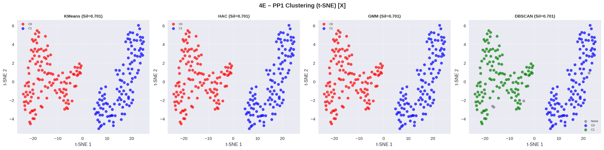

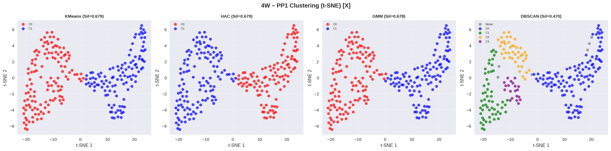

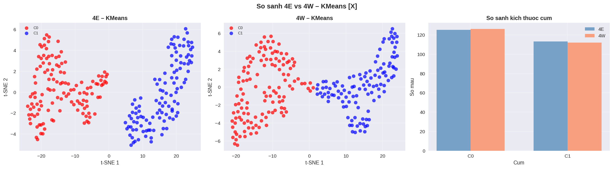

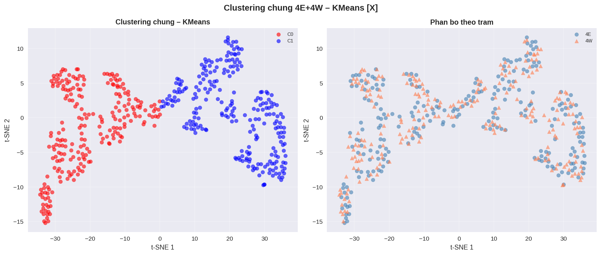

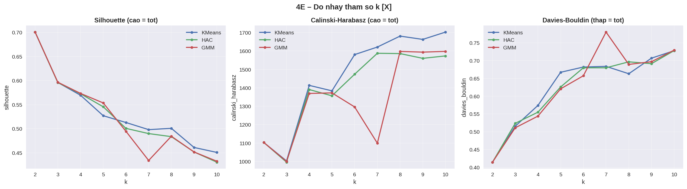

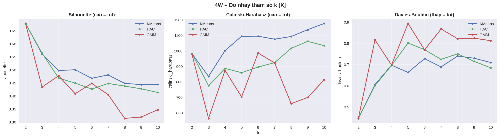

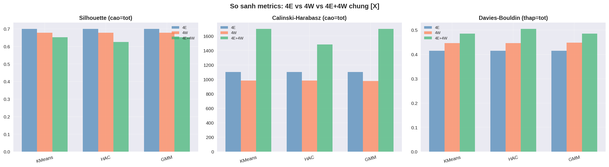

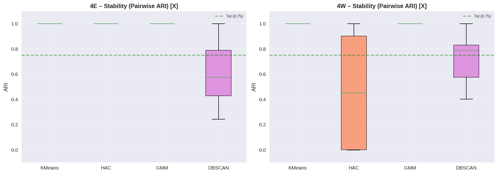

### 4.3. `Y_Coord`

#### 4.3.1. Quét `k = 2..10` theo Silhouette

**Trạm 4E**

| k | KMeans | HAC | GMM |
|---|-------:|----:|----:|
| 2 | 0.5841 | 0.5815 | 0.5817 |
| 3 | 0.5242 | 0.5006 | 0.5204 |
| 4 | 0.4662 | 0.4405 | 0.4731 |
| 5 | 0.5040 | 0.4670 | 0.5042 |
| 6 | 0.4662 | 0.4255 | 0.4941 |
| 7 | 0.4791 | 0.4339 | 0.4422 |
| 8 | 0.4675 | 0.4292 | 0.3864 |
| 9 | 0.4404 | 0.4332 | 0.3841 |
| 10 | 0.4278 | 0.4135 | 0.3529 |

**Trạm 4W**

| k | KMeans | HAC | GMM |
|---|-------:|----:|----:|
| 2 | 0.6794 | 0.6794 | 0.6794 |
| 3 | 0.6180 | 0.5952 | 0.5917 |
| 4 | 0.5824 | 0.5375 | 0.5634 |
| 5 | 0.5335 | 0.4809 | 0.5093 |
| 6 | 0.5062 | 0.4729 | 0.4777 |
| 7 | 0.5003 | 0.4798 | 0.4066 |
| 8 | 0.5222 | 0.5032 | 0.4544 |
| 9 | 0.4752 | 0.5073 | 0.4640 |
| 10 | 0.4729 | 0.4496 | 0.4111 |

Kết quả voting:

- 4E: `KMeans -> 2`, `HAC -> 2`, `GMM -> 2`
- 4W: `KMeans -> 2`, `HAC -> 2`, `GMM -> 2`
- Kết luận: `k = 2`

#### 4.3.2. Metric phân cụm chính

| Tập dữ liệu | Thuật toán | k | Silhouette | Calinski-Harabasz | Davies-Bouldin |
|-------------|------------|--:|-----------:|------------------:|---------------:|
| 4E | **KMeans** | 2 | **0.5841** | **529.0** | **0.6354** |
| 4E | HAC | 2 | 0.5815 | 524.1 | 0.6388 |
| 4E | GMM | 2 | 0.5817 | 522.9 | 0.6361 |
| 4E | DBSCAN | 4 | 0.3726 | 355.1 | 0.8366 |
| 4W | **KMeans** | 2 | **0.6794** | **771.1** | **0.4293** |
| 4W | HAC | 2 | 0.6794 | 771.1 | 0.4293 |
| 4W | GMM | 2 | 0.6794 | 771.1 | 0.4293 |
| 4W | DBSCAN | 5 | 0.5708 | 859.7 | 0.5809 |
| 4E+4W | **KMeans** | 2 | **0.6749** | **1614.6** | **0.4365** |
| 4E+4W | HAC | 2 | 0.6749 | 1614.6 | 0.4365 |
| 4E+4W | GMM | 2 | 0.6749 | 1614.6 | 0.4365 |
| 4E+4W | DBSCAN | 9 | 0.3158 | 1652.4 | 0.6860 |

#### 4.3.3. Độ nhạy và độ ổn định

**K tốt nhất theo Silhouette**

| Trạm | KMeans | HAC | GMM |
|------|--------|-----|-----|
| 4E | `k=2 (0.5841)` | `k=2 (0.5815)` | `k=2 (0.5817)` |
| 4W | `k=2 (0.6794)` | `k=2 (0.6794)` | `k=2 (0.6794)` |

**GMM covariance types tốt nhất theo BIC**

| Trạm | full | tied | diag | spherical |
|------|------|------|------|-----------|
| 4E | `k=6, BIC=2968.8` | `k=10, BIC=2997.7` | `k=6, BIC=2965.9` | `k=7, BIC=3016.0` |
| 4W | `k=5, BIC=2865.7` | `k=8, BIC=2858.3` | `k=8, BIC=2874.4` | `k=8, BIC=2865.7` |

**DBSCAN tốt nhất sau quét tham số**

| Trạm | MinPts | eps | Số cụm | Silhouette |
|------|-------:|----:|-------:|-----------:|
| 4E | 3 | 1.7035 | 2 | 0.5815 |
| 4W | 3 | 1.5094 | 2 | 0.6825 |

**Stability summary**

| Trạm | Thuật toán | ARI mean | ARI std | Đánh giá |
|------|------------|---------:|--------:|----------|
| 4E | KMeans | 1.000 | 0.000 | Có |
| 4E | HAC | 1.000 | 0.000 | Có |
| 4E | GMM | 1.000 | 0.000 | Có |
| 4E | DBSCAN | 0.716 | 0.191 | Trung bình |
| 4W | KMeans | 1.000 | 0.000 | Có |
| 4W | HAC | 1.000 | 0.000 | Có |
| 4W | GMM | 1.000 | 0.000 | Có |
| 4W | DBSCAN | 0.736 | 0.173 | Trung bình |

#### 4.3.4. Nhận xét

- `Y_Coord` là trục mạnh nhất của 4W và cũng là trục tốt nhất khi gộp chung 4E+4W.
- Ba thuật toán KMeans, HAC và GMM gần như trùng nhau hoàn toàn trên 4W.
- `Y_Coord` có độ ổn định đồng đều nhất giữa hai trạm.

#### 4.3.5. Hình kết quả

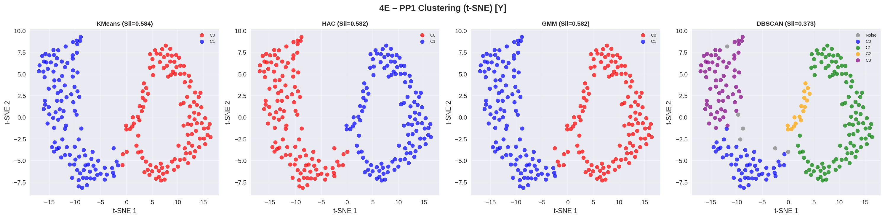

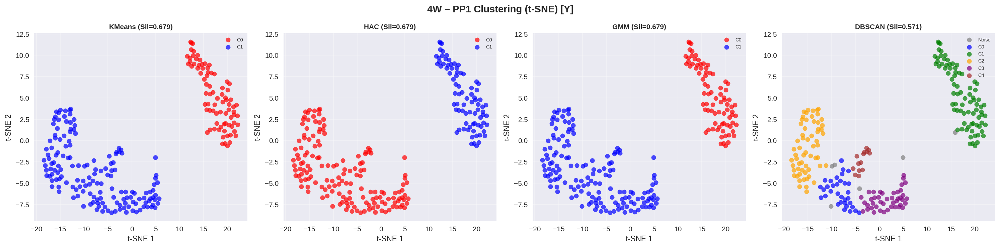

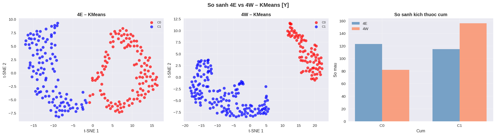

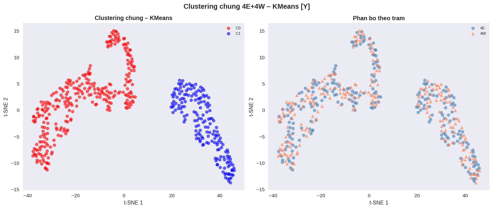

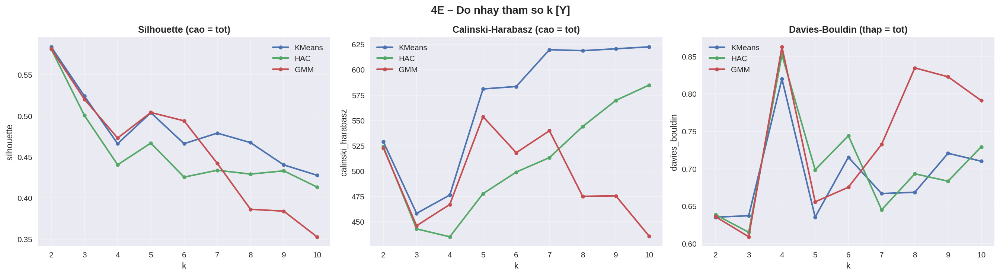

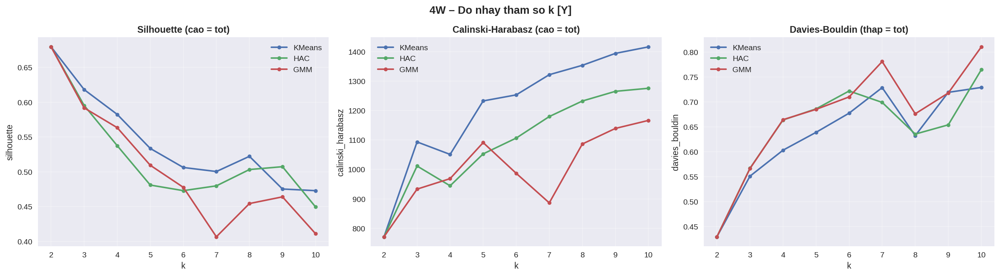

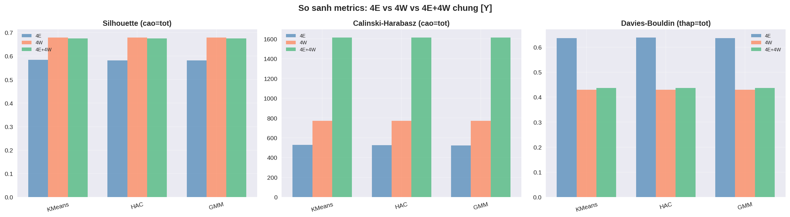

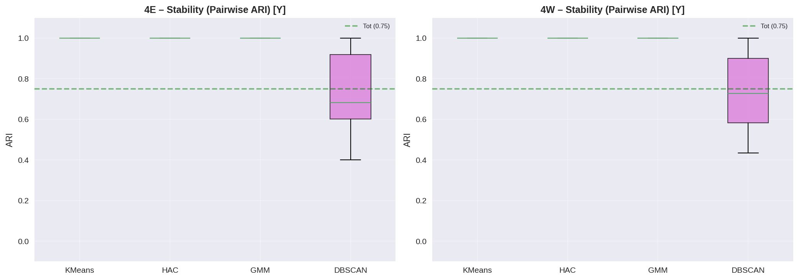

### 4.4. `h_Coord`

#### 4.4.1. Quét `k = 2..10` theo Silhouette

**Trạm 4E**

| k | KMeans | HAC | GMM |
|---|-------:|----:|----:|
| 2 | 0.6677 | 0.6652 | 0.6652 |
| 3 | 0.5851 | 0.5705 | 0.5587 |
| 4 | 0.5198 | 0.4842 | 0.4657 |
| 5 | 0.4799 | 0.4604 | 0.4292 |
| 6 | 0.4938 | 0.4685 | 0.4515 |
| 7 | 0.4638 | 0.4628 | 0.4599 |
| 8 | 0.4530 | 0.4438 | 0.4368 |
| 9 | 0.4378 | 0.4072 | 0.4365 |
| 10 | 0.4439 | 0.3923 | 0.4254 |

**Trạm 4W**

| k | KMeans | HAC | GMM |
|---|-------:|----:|----:|
| 2 | 0.5109 | 0.4775 | 0.5098 |
| 3 | 0.4789 | 0.4795 | 0.4757 |
| 4 | 0.4901 | 0.4888 | 0.4694 |
| 5 | 0.5142 | 0.5026 | 0.5078 |
| 6 | 0.5160 | 0.4995 | 0.4965 |
| 7 | 0.5091 | 0.4738 | 0.4675 |
| 8 | 0.5111 | 0.4920 | 0.4992 |
| 9 | 0.4884 | 0.4446 | 0.4331 |
| 10 | 0.4900 | 0.4325 | 0.4414 |

Kết quả voting:

- 4E: `KMeans -> 2`, `HAC -> 2`, `GMM -> 2`
- 4W: `KMeans -> 6`, `HAC -> 5`, `GMM -> 2`
- Kết luận riêng từng trạm: `4E = 2`, `4W = 6`
- Kết luận dùng trong báo cáo: `k = 2`

#### 4.4.2. Metric phân cụm chính

| Tập dữ liệu | Thuật toán | k | Silhouette | Calinski-Harabasz | Davies-Bouldin |
|-------------|------------|--:|-----------:|------------------:|---------------:|
| 4E | **KMeans** | 2 | **0.6677** | **924.5** | **0.4486** |
| 4E | HAC | 2 | 0.6652 | 899.4 | 0.4490 |
| 4E | GMM | 2 | 0.6652 | 899.4 | 0.4490 |
| 4E | DBSCAN | 4 | 0.3113 | 340.6 | 0.7551 |
| 4W | **KMeans** | 2 | **0.5109** | **331.6** | 0.7818 |
| 4W | HAC | 2 | 0.4775 | 267.8 | 0.8385 |
| 4W | GMM | 2 | 0.5098 | 326.7 | **0.7812** |
| 4W | DBSCAN | 6 | 0.2574 | 171.0 | 0.5948 |
| 4E+4W | **KMeans** | 2 | **0.5575** | **836.6** | **0.6998** |
| 4E+4W | HAC | 2 | 0.5574 | 836.6 | 0.7000 |
| 4E+4W | GMM | 2 | 0.5575 | 836.2 | 0.6998 |
| 4E+4W | DBSCAN | 13 | 0.2765 | 659.1 | 0.6882 |

#### 4.4.3. Độ nhạy và độ ổn định

**K tốt nhất theo Silhouette**

| Trạm | KMeans | HAC | GMM |
|------|--------|-----|-----|
| 4E | `k=2 (0.6677)` | `k=2 (0.6652)` | `k=2 (0.6652)` |
| 4W | `k=6 (0.5160)` | `k=5 (0.5026)` | `k=2 (0.5098)` |

**GMM covariance types tốt nhất theo BIC**

| Trạm | full | tied | diag | spherical |
|------|------|------|------|-----------|
| 4E | `k=4, BIC=2989.3` | `k=8, BIC=2974.9` | `k=6, BIC=3001.1` | `k=7, BIC=2985.3` |
| 4W | `k=6, BIC=2969.0` | `k=9, BIC=2938.4` | `k=8, BIC=2948.2` | `k=8, BIC=2948.3` |

**DBSCAN tốt nhất sau quét tham số**

| Trạm | MinPts | eps | Số cụm | Silhouette |
|------|-------:|----:|-------:|-----------:|
| 4E | 6 | 1.8500 | 2 | 0.6752 |
| 4W | 9 | 1.8177 | 7 | 0.5296 |

**Stability summary**

| Trạm | Thuật toán | ARI mean | ARI std | Đánh giá |
|------|------------|---------:|--------:|----------|
| 4E | KMeans | 1.000 | 0.000 | Có |
| 4E | HAC | 0.494 | 0.483 | Không |
| 4E | GMM | 1.000 | 0.000 | Có |
| 4E | DBSCAN | 0.687 | 0.228 | Trung bình |
| 4W | KMeans | 1.000 | 0.000 | Có |
| 4W | HAC | 0.830 | 0.159 | Có |
| 4W | GMM | 1.000 | 0.000 | Có |
| 4W | DBSCAN | 0.656 | 0.246 | Trung bình |

#### 4.4.4. Nhận xét

- `h_Coord` là trục duy nhất có bất đồng rõ ràng về `k` tại trạm 4W.
- Ở 4E, `h_Coord` vẫn rất mạnh với Silhouette `0.6677`.
- Ở 4W, `h_Coord` yếu hơn rõ rệt so với `X_Coord` và `Y_Coord`, nhưng vẫn giữ ý nghĩa vật lý quan trọng nhất cho dịch chuyển thẳng đứng.

#### 4.4.5. Hình kết quả

Các hình của `h_Coord` được chuẩn hóa theo hậu tố `_h` để nhất quán với `X_Coord` và `Y_Coord`.


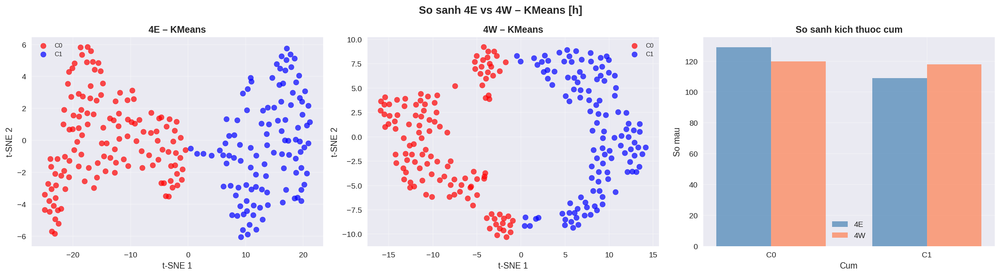

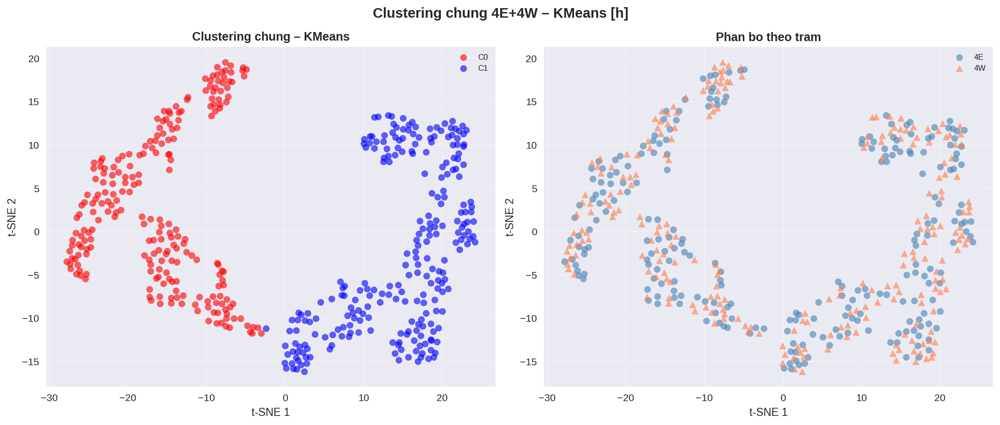

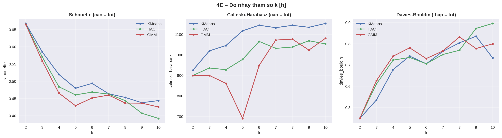


---

## 5. Bước 6/6: Phân tích đa biến `(X, Y, h)` và tương quan

### 5.1. Tạo ma trận đa biến và tiền xử lý

| Thông số | 4E | 4W | Gộp chung |
|----------|----|----|-----------|
| Missing threshold | 5.0% | 5.0% | 5.0% |
| Số giờ hợp lệ | 238 | 238 | 238 giờ chung |
| Ma trận matched | `(238, 3600)` | `(238, 3600)` | - |
| X sau reshape | `(238, 360)` | `(238, 360)` | - |
| Y sau reshape | `(238, 360)` | `(238, 360)` | - |
| h sau reshape | `(238, 360)` | `(238, 360)` | - |
| Feature đa biến sau ghép | `(238, 1080)` | `(238, 1080)` | `(476, 1080)` |

Embedding trong log:

- 4E: `PCA (238, 50), explained = 100.0%`, `t-SNE (238, 2)`
- 4W: `PCA (238, 50), explained = 100.0%`, `t-SNE (238, 2)`
- Gộp chung: `PCA (476, 50), explained = 100.0%`, `t-SNE (476, 2)`

### 5.2. Metric phân cụm đa biến

| Tập dữ liệu | Thuật toán | k | Silhouette | Calinski-Harabasz | Davies-Bouldin |
|-------------|------------|--:|-----------:|------------------:|---------------:|
| 4E | **KMeans** | 2 | **0.6375** | **765.5** | 0.4861 |
| 4E | HAC | 2 | 0.6366 | 754.5 | **0.4829** |
| 4E | GMM | 2 | 0.6121 | 704.8 | 0.5158 |
| 4E | DBSCAN | 3 | 0.5002 | 704.2 | 0.5217 |
| 4W | **KMeans** | 2 | **0.6269** | **730.7** | **0.5127** |
| 4W | HAC | 2 | 0.6256 | 721.5 | 0.5187 |
| 4W | GMM | 2 | 0.6194 | 700.2 | 0.5237 |
| 4W | DBSCAN | 7 | 0.4833 | 1090.3 | 0.6245 |
| 4E+4W | **KMeans** | 2 | **0.5801** | **703.7** | **0.7227** |
| 4E+4W | HAC | 2 | 0.5801 | 703.7 | 0.7227 |
| 4E+4W | GMM | 2 | 0.5801 | 703.7 | 0.7227 |
| 4E+4W | DBSCAN | 14 | 0.3760 | 1503.8 | 0.6805 |

### 5.3. Tương quan nội cụm

**Trạm 4E**

| Cụm | Số mẫu | X-Y | X-h | Y-h |
|-----|------:|----:|----:|----:|
| 0 | 146 | 0.126 | 0.024 | -0.044 |
| 1 | 92 | 0.086 | 0.008 | -0.063 |

**Trạm 4W**

| Cụm | Số mẫu | X-Y | X-h | Y-h |
|-----|------:|----:|----:|----:|
| 0 | 131 | 0.137 | 0.092 | -0.030 |
| 1 | 107 | 0.196 | 0.003 | 0.032 |

Nhận xét:

- Tương quan nội cụm giữa các trục nhìn chung thấp trên cả hai trạm.
- Cặp `X-Y` là cặp có tương quan dương rõ nhất trong cả hai trạm, nhưng vẫn chỉ ở mức yếu.
- Các cặp liên quan đến `h` gần như độc lập hoặc tương quan rất nhỏ, cho thấy thành phần thẳng đứng không đồng biến mạnh với hai trục ngang trong cùng cụm.

### 5.4. Tương quan 4E vs 4W theo cụm

| Cụm | Số mẫu 4E | Số mẫu 4W | X | Y | h |
|-----|----------:|----------:|---|---|---|
| 0 | 0 | 238 | N/A | N/A | N/A |
| 1 | 238 | 0 | N/A | N/A | N/A |

Nhận xét:

- Pearson theo cụm không tính được vì hai cụm trong kết quả đa biến chung bị tách hoàn toàn theo trạm.
- Cụm `0` chỉ chứa mẫu của 4W, còn cụm `1` chỉ chứa mẫu của 4E.
- Điều này cho thấy embedding đa biến chung đang học khác biệt giữa hai trạm mạnh hơn quan hệ đồng biến nội cụm giữa 4E và 4W.

### 5.5. Nhận xét tổng hợp cho bước đa biến

- Trên từng trạm riêng lẻ, phân tích đa biến vẫn cho chất lượng tốt với KMeans: `Sil=0.6375` ở 4E và `Sil=0.6269` ở 4W.
- So với đơn biến tốt nhất, đa biến không vượt `X_Coord` ở 4E và không vượt `Y_Coord` ở 4W, nhưng cho kết quả cân bằng hơn khi gộp cả ba trục.
- Ở bài toán gộp chung 4E+4W, đa biến đạt `Sil=0.5801`, thấp hơn `Y_Coord` đơn biến (`0.6749`) nhưng vẫn cao hơn `h_Coord` đơn biến (`0.5575`).
- DBSCAN trong không gian đa biến tiếp tục tạo nhiều cụm hơn và kém dễ diễn giải hơn KMeans/HAC/GMM.

### 5.6. Hình kết quả đa biến

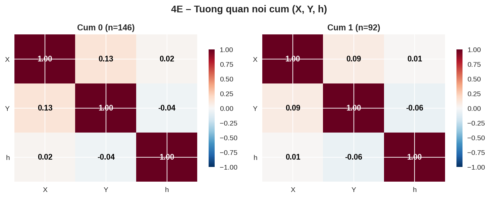

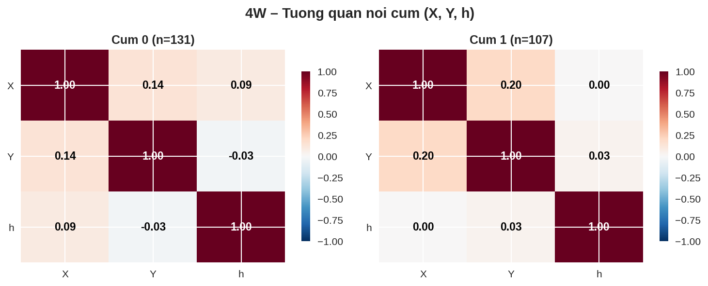

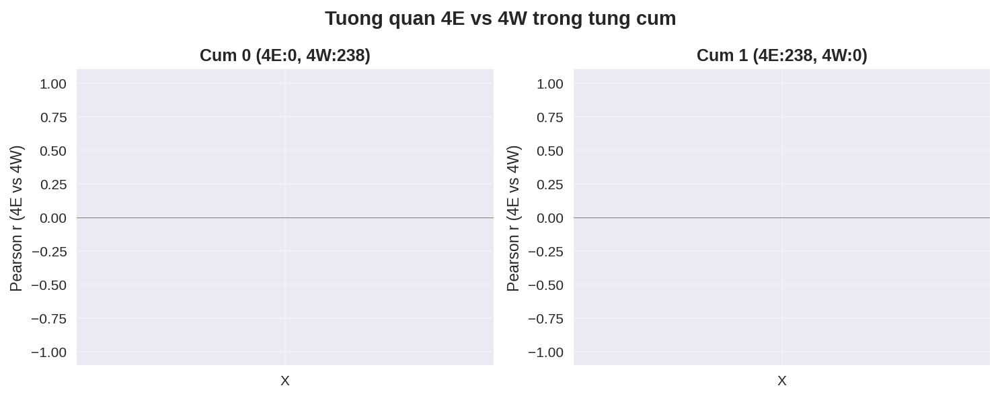

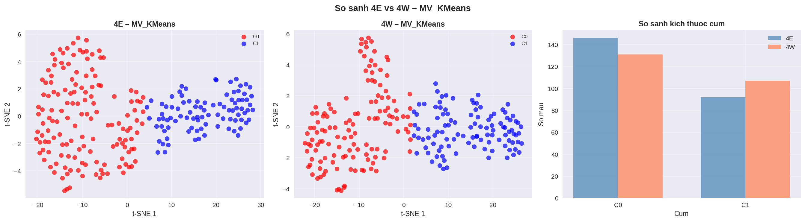

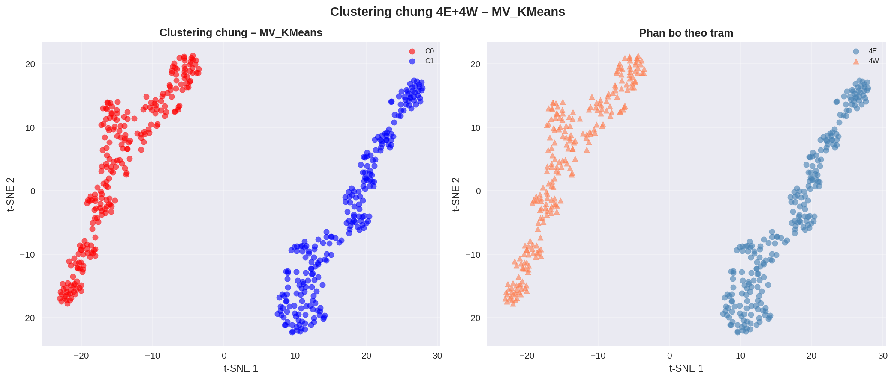

---

## 6. Tóm tắt kết quả cuối cùng

### 6.1. Số mẫu matched theo từng trục

| Trục | 4E | 4W |
|------|---:|---:|
| X_Coord | 238 | 238 |
| Y_Coord | 238 | 238 |
| h_Coord | 238 | 238 |

### 6.2. Mô hình tốt nhất theo từng trục đơn biến

| Trục | Tập dữ liệu | Thuật toán tốt nhất | k | Silhouette | Calinski-Harabasz | Davies-Bouldin |
|------|-------------|---------------------|--:|-----------:|------------------:|---------------:|
| X_Coord | 4E | KMeans | 2 | 0.7006 | 1102.9 | 0.4147 |
| X_Coord | 4W | KMeans | 2 | 0.6787 | 981.8 | 0.4461 |
| X_Coord | 4E+4W | KMeans | 2 | 0.6529 | 1699.2 | 0.4851 |
| Y_Coord | 4E | KMeans | 2 | 0.5841 | 529.0 | 0.6354 |
| Y_Coord | 4W | KMeans | 2 | 0.6794 | 771.1 | 0.4293 |
| Y_Coord | 4E+4W | KMeans | 2 | 0.6749 | 1614.6 | 0.4365 |
| h_Coord | 4E | KMeans | 2 | 0.6677 | 924.5 | 0.4486 |
| h_Coord | 4W | KMeans | 2 | 0.5109 | 331.6 | 0.7818 |
| h_Coord | 4E+4W | KMeans | 2 | 0.5575 | 836.6 | 0.6998 |

### 6.3. Kết quả tốt nhất của PP1 đa biến `(X, Y, h)`

| Tập dữ liệu | Thuật toán tốt nhất | k | Silhouette | Calinski-Harabasz | Davies-Bouldin |
|-------------|---------------------|--:|-----------:|------------------:|---------------:|
| 4E | KMeans | 2 | 0.6375 | 765.5 | 0.4861 |
| 4W | KMeans | 2 | 0.6269 | 730.7 | 0.5127 |
| 4E+4W | KMeans | 2 | 0.5801 | 703.7 | 0.7227 |

### 6.4. So sánh ba trục theo Silhouette tốt nhất của KMeans

| Trục | 4E | 4W | 4E+4W |
|------|---:|---:|------:|
| X | **0.7006** | 0.6787 | 0.6529 |
| Y | 0.5841 | **0.6794** | **0.6749** |
| h | 0.6677 | 0.5109 | 0.5575 |

### 6.5. Kết luận chính

- Với 4E, `X_Coord` là trục đơn biến mạnh nhất; `h_Coord` đứng thứ hai; `Y_Coord` thấp hơn rõ rệt.
- Với 4W, `Y_Coord` và `X_Coord` đều mạnh, trong khi `h_Coord` yếu hơn và nhạy hơn với việc chọn `k`.
- Với dữ liệu gộp 4E+4W, `Y_Coord` cho kết quả tốt nhất; `X_Coord` xếp thứ hai; `h_Coord` thấp nhất.
- Phân tích đa biến cho kết quả tốt và cân bằng trên từng trạm riêng lẻ, nhưng ở dữ liệu gộp chung vẫn chưa vượt trục `Y_Coord` đơn biến.
- Trong clustering đa biến chung, hai cụm bị phân tách hoàn toàn theo trạm, nên tương quan 4E-vs-4W theo cụm không xác định.
- Về độ ổn định tổng thể, `Y_Coord` là trục đẹp nhất giữa hai trạm.
- Về ý nghĩa vật lý, `h_Coord` vẫn cần được giữ làm kênh diễn giải chính cho chuyển vị thẳng đứng dù chất lượng phân cụm số học không phải lúc nào cũng cao nhất.

---

## 7. Danh mục file kết quả

### 7.1. Trục `X_Coord`

- `C02_scatter_4E_x.png`
- `C02_scatter_4W_x.png`
- `C04_comparison_KMeans_x.png`
- `C05_joint_KMeans_x.png`
- `C08_metrics_comparison_x.png`
- `C01_k_sensitivity_4E_x.png`
- `C01_k_sensitivity_4W_x.png`
- `C03_stability_comparison_x.png`
- `C_sensitivity_4E_x.csv`
- `C_sensitivity_4W_x.csv`

### 7.2. Trục `Y_Coord`

- `C02_scatter_4E_y.png`
- `C02_scatter_4W_y.png`
- `C04_comparison_KMeans_y.png`
- `C05_joint_KMeans_y.png`
- `C08_metrics_comparison_y.png`
- `C01_k_sensitivity_4E_y.png`
- `C01_k_sensitivity_4W_y.png`
- `C03_stability_comparison_y.png`
- `C_sensitivity_4E_y.csv`
- `C_sensitivity_4W_y.csv`

### 7.3. Trục `h_Coord`

- `C02_scatter_4E_h.png`
- `C02_scatter_4W_h.png`
- `C04_comparison_KMeans_h.png`
- `C05_joint_KMeans_h.png`
- `C08_metrics_comparison_h.png`
- `C01_k_sensitivity_4E_h.png`
- `C01_k_sensitivity_4W_h.png`
- `C03_stability_comparison_h.png`
- `C_sensitivity_4E_h.csv`
- `C_sensitivity_4W_h.csv`

---

### 7.4. Đa biến `(X, Y, h)`

- `C06_intra_corr_4E.png`
- `C06_intra_corr_4W.png`
- `C07_cross_station_corr.png`
- `C04_comparison_MV_KMeans.png`
- `C05_joint_MV_KMeans.png`

---

## 8. Lệnh chạy lại

```bash
# Chạy đầy đủ 6/6, gồm cả X/Y/h đơn biến và đa biến
python step5_pp1_complete.py --missing-thresh 5 --no-display

# Chạy đến bước 5/6, bỏ qua đa biến
python step5_pp1_complete.py --missing-thresh 5 --no-display --skip-multivariate

# Ép cùng một số cụm cho cả ba trục
python step5_pp1_complete.py --k 2 --missing-thresh 5 --no-display

# Bỏ qua phân tích độ nhạy và độ ổn định
python step5_pp1_complete.py --k 2 --missing-thresh 5 --no-display --skip-sensitivity
```

Kết quả được lưu tại `result/09_pp1_complete/`.
