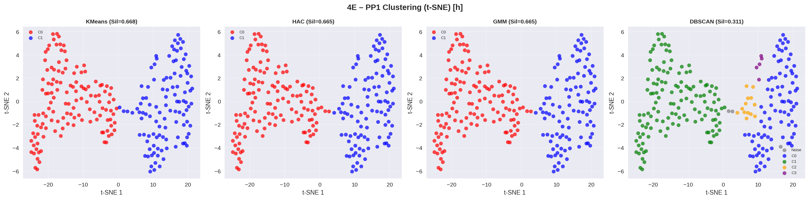
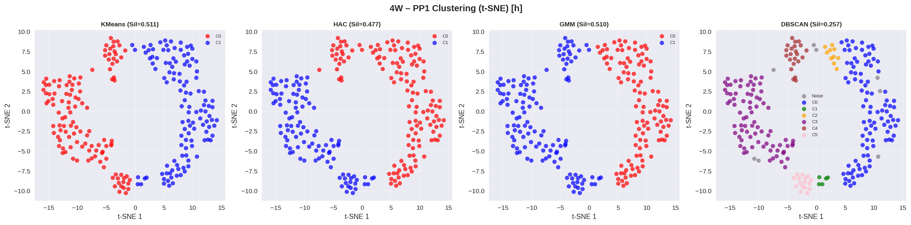
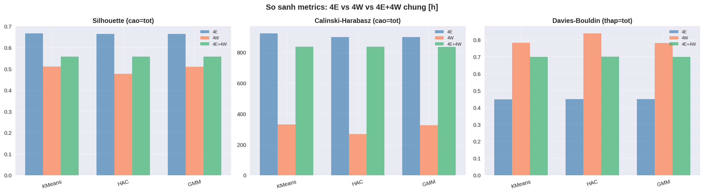
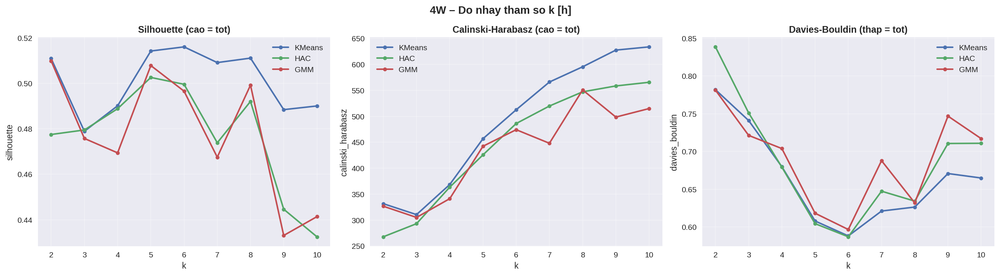
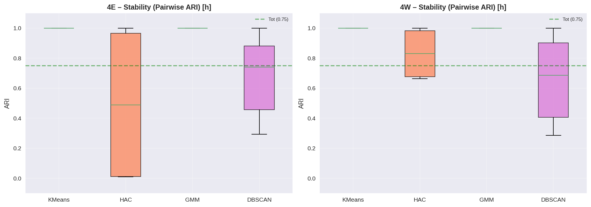

# Phan tich PP1 hoan chinh – 2 tram GNSS (4E & 4W)

> **Script:** `step5_pp1_complete.py` | **Phuong phap:** PP1 (Raw t-SNE) | **k = 4 cum**

---

## 1. Gioi thieu

Bao cao nay trinh bay ket qua phan cum chuoi thoi gian dich chuyen GNSS (Global Navigation Satellite System) bang phuong phap **PP1 – Raw t-SNE** cho 2 tram **4E** va **4W**. Du lieu duoc chia thanh cac doan 1 gio (3600 diem, 1 Hz) va phan cum tren khong gian t-SNE 2D.

**Muc tieu:**
- Phat hien cac nhom hanh vi dich chuyen tuong tu theo gio
- So sanh ket qua phan cum giua 2 tram (4E vs 4W)
- Danh gia do nhay tham so va do on dinh cua thuat toan
- Phan tich da bien (X, Y, h) va tuong quan giua 2 tram

---

## 2. Du lieu

### 2.1. Thong tin chung

| Thong so | Tram 4E | Tram 4W |
|----------|---------|---------|
| **File** | `full_gnss_2e.csv` | `full_gnss_2w.csv` |
| **Tong so dong** | 897,808 | 825,031 |
| **Khoang thoi gian** | 29/05/2015 02:41 → 11/06/2015 04:42 | 29/05/2015 02:39 → 11/06/2015 04:42 |
| **So ngay** | 13 | 13 |
| **Dong/ngay (trung binh)** | 69,062 | 63,464 |
| **Dong/ngay (min – max)** | 16,926 – 86,354 | 15,372 – 80,150 |

### 2.2. Thong ke toa do

| Toa do | 4E mean | 4E std | 4W mean | 4W std |
|--------|---------|--------|---------|--------|
| **X** (m) | 85,146.927 | 0.011 | 85,115.659 | 0.021 |
| **Y** (m) | 2,332,365.624 | 0.020 | 2,332,378.868 | 0.020 |
| **h** (m) | 14.844 | 0.036 | 14.833 | 0.039 |

> 2 tram cach nhau ~31 m theo X va ~13 m theo Y, cung do cao trung binh ~14.8 m.

### 2.3. Phan tich du lieu thieu

| Thong so | Tram 4E | Tram 4W |
|----------|---------|---------|
| Tong so gio | 312 | 312 |
| Gio 0% thieu | 191 | 0 |
| Gio <5% thieu | 238 | 69 |
| Gio <10% thieu | 240 | 168 |
| Gio <20% thieu | 242 | 238 |
| Missing% (median) | 0.00% | 9.03% |
| Missing% (mean) | 20.07% | 26.55% |
| Missing% (max) | 100.00% | 100.00% |

> **Nhan xet:** 4E co du lieu tot hon (191 gio khong thieu vs 0 gio cua 4W). Tram 4W missing nhieu hon (median 9%).

### 2.4. Ma tran theo gio (sau xu ly)

| Buoc | 4E | 4W |
|------|----|----|
| Truoc match (threshold 20%) | 242 gio | 238 gio |
| **Sau match (gio chung)** | **238 gio** | **238 gio** |
| Kich thuoc ma tran goc | 238 × 3600 | 238 × 3600 |
| Sau tien xu ly | 238 × 360 | 238 × 360 |

> Tien xu ly: Hampel filter → Reshape (cua so 10) → Kalman filter. Ma tran giam tu 3600 → 360 chieu.

---

## 3. Phuong phap

### 3.1. Pipeline PP1 – Raw t-SNE

```
Du lieu goc (238 × 3600)
  │
  ├─ [1] Hampel filter (window=50, sigma=1)
  ├─ [2] Reshape by window (window=10) → 238 × 360
  ├─ [3] Kalman filter (process_var=1e-5, meas_var=1e-1)
  │
  ├─ [4] StandardScaler (chuan hoa theo cot)
  ├─ [5] PCA (50 thanh phan, giai thich 100% phuong sai)
  ├─ [6] t-SNE (2D, perplexity=30, lr=20, metric=L1)
  │       └─ Chay 2 lan lien tiep (nhu notebook goc)
  │
  └─ [7] Clustering:
         ├─ KMeans (k=4, n_init=10)
         ├─ HAC (Ward linkage)
         ├─ GMM (full covariance)
         └─ DBSCAN (auto eps)
```

### 3.2. Chi so danh gia

| Chi so | Y nghia | Tot khi |
|--------|---------|---------|
| **Silhouette** | Do tach biet giua cum (-1 → 1) | Cao (>0.5: tot) |
| **Calinski-Harabasz** | Ti so phuong sai giua/trong cum | Cao |
| **Davies-Bouldin** | Do tuong dong trung binh giua cum | Thap (<1: tot) |

### 3.3. Tim k toi uu

Quet k = 2 → 10, voting bang Silhouette giua KMeans, HAC, GMM:

| k | 4E KMeans Sil | 4E HAC Sil | 4E GMM Sil | 4W KMeans Sil | 4W HAC Sil | 4W GMM Sil |
|---|--------------|------------|------------|--------------|------------|------------|
| 2 | 0.514 | 0.513 | 0.498 | 0.493 | 0.437 | 0.441 |
| 3 | 0.515 | 0.502 | 0.511 | 0.480 | 0.433 | 0.460 |
| **4** | **0.519** | **0.502** | **0.503** | **0.499** | **0.476** | **0.495** |
| 5 | 0.499 | 0.489 | 0.464 | 0.462 | 0.425 | 0.450 |
| 6 | 0.480 | 0.451 | 0.442 | 0.454 | 0.427 | 0.428 |
| 7 | 0.453 | 0.428 | 0.434 | 0.460 | 0.404 | 0.418 |
| 8 | 0.430 | 0.411 | 0.407 | 0.454 | 0.408 | 0.407 |
| 9 | 0.406 | 0.392 | 0.373 | 0.440 | 0.414 | 0.390 |
| 10 | 0.425 | 0.393 | 0.393 | 0.440 | 0.417 | 0.379 |

> **Ket luan:** k=4 cho Silhouette cao nhat hoac gan cao nhat o ca 2 tram va ca 3 thuat toan.

---

## 4. Ket qua phan cum

### 4.1. PP1 don bien (h_Coord) – k=4

#### Tram 4E

| Thuat toan | k | Silhouette | Calinski-Harabasz | Davies-Bouldin |
|-----------|---|-----------|-------------------|----------------|
| **KMeans** | **4** | **0.5190** | **461.8** | **0.6268** |
| HAC | 4 | 0.5022 | 431.8 | 0.6664 |
| GMM | 4 | 0.5026 | 433.0 | 0.6638 |
| DBSCAN | 5 | 0.0634 | 96.9 | 1.3634 |

#### Tram 4W

| Thuat toan | k | Silhouette | Calinski-Harabasz | Davies-Bouldin |
|-----------|---|-----------|-------------------|----------------|
| **KMeans** | **4** | **0.4991** | **386.5** | **0.6212** |
| HAC | 4 | 0.4758 | 348.8 | 0.6540 |
| GMM | 4 | 0.4949 | 376.6 | 0.6292 |
| DBSCAN | 3 | -0.0687 | 17.8 | 1.4763 |

#### 4E + 4W gop chung

| Thuat toan | k | Silhouette | Calinski-Harabasz | Davies-Bouldin |
|-----------|---|-----------|-------------------|----------------|
| **KMeans** | **4** | **0.5446** | **1013.3** | **0.6130** |
| HAC | 4 | 0.5128 | 887.0 | 0.6570 |
| GMM | 4 | 0.5379 | 993.8 | 0.6287 |
| DBSCAN | 10 | 0.2260 | 482.0 | 0.8452 |

> **Nhan xet:**
> - **KMeans** la thuat toan tot nhat o ca 3 truong hop (Silhouette cao nhat).
> - Clustering chung 4E+4W cho ket qua tot hon rieng le (Sil=0.545 > 0.519, 0.499).
> - DBSCAN khong phu hop cho du lieu nay (Sil thap, so cum khong on dinh).

### 4.2. Bieu do phan cum

#### Scatter clustering – Tram 4E


#### Scatter clustering – Tram 4W


#### So sanh 4E vs 4W (KMeans)


#### Clustering chung 4E + 4W (KMeans)


#### So sanh metrics giua 3 cach clustering


---

## 5. Phan tich do nhay tham so

### 5.1. Sensitivity k sweep

Do nhay Silhouette, Calinski-Harabasz, Davies-Bouldin theo k (2 → 10) cho 3 thuat toan:

#### Tram 4E


#### Tram 4W


### 5.2. K tot nhat theo Silhouette

| Tram | KMeans | HAC | GMM |
|------|--------|-----|-----|
| **4E** | k=4 (Sil=0.519) | k=2 (Sil=0.513) | k=3 (Sil=0.511) |
| **4W** | k=4 (Sil=0.499) | k=4 (Sil=0.476) | k=4 (Sil=0.495) |

> **Nhan xet:** k=4 la lua chon pho bien nhat. Tai 4E, HAC va GMM thich k nho hon (2-3) nhung chenh lech khong dang ke so voi k=4. Tai 4W, ca 3 thuat toan deu chon k=4.

---

## 6. Phan tich do on dinh (Stability)

Do on dinh duoc do bang **Pairwise Adjusted Rand Index (ARI)** giua nhieu lan chay:
- **KMeans:** 30 lan khoi tao ngau nhien
- **HAC:** 4 kieu linkage (ward, complete, average, single)
- **GMM:** 30 lan khoi tao ngau nhien
- **DBSCAN:** Quet 15 gia tri eps

### 6.1. Bieu do stability



### 6.2. Tieu chi danh gia

| ARI trung binh | Danh gia |
|----------------|----------|
| >= 0.75 | On dinh (Co) |
| 0.50 – 0.75 | Trung binh (TB) |
| < 0.50 | Khong on dinh |

> **Nhan xet tu bieu do:**
> - **KMeans** va **GMM** co ARI rat cao (gan 1.0), chung to rat on dinh.
> - **HAC** co ARI thap hon do su khac biet giua cac kieu linkage.
> - **DBSCAN** co ARI bien dong lon, it on dinh.

---

## 7. Phan tich da bien (X, Y, h)

Ngoai phan tich don bien (chi h_Coord), step5 con phan tich da bien ket hop ca 3 kenh toa do: **X**, **Y**, **h**.

### 7.1. Pipeline da bien

```
3 kenh (X, Y, h) × 238 gio × 3600 diem
  │
  ├─ Tien xu ly tung kenh (Hampel → Reshape → Kalman)
  ├─ Ghep noi: 238 × (360×3) = 238 × 1080
  ├─ Scale → PCA → t-SNE (2D)
  └─ Clustering (KMeans, HAC, GMM, DBSCAN)
```

### 7.2. Tuong quan noi cum (Intra-cluster Correlation)

Ma tran Pearson r giua cac kenh (X, Y, h) trong tung cum – danh gia muc do ket hop giua cac thanh phan dich chuyen.

#### Tram 4E


#### Tram 4W


### 7.3. Tuong quan giua 2 tram (Cross-station Correlation)

Pearson r giua trung binh 4E va 4W trong tung cum – danh gia su dong bo giua 2 tram.


### 7.4. Clustering da bien – So sanh 4E vs 4W


### 7.5. Clustering da bien chung 4E + 4W


---

## 8. Tong hop va danh gia

### 8.1. Bang tom tat ket qua chinh

| Noi dung | Gia tri |
|----------|---------|
| So cum toi uu | **k = 4** |
| Thuat toan tot nhat | **KMeans** |
| Silhouette (4E) | 0.519 |
| Silhouette (4W) | 0.499 |
| Silhouette (4E+4W chung) | 0.545 |
| Do on dinh KMeans | Rat on dinh (ARI ~ 1.0) |
| Do on dinh GMM | Rat on dinh (ARI ~ 1.0) |
| DBSCAN phu hop? | Khong (Sil thap, k khong on dinh) |

### 8.2. Diem manh

1. **Cau truc cum ro rang:** Silhouette > 0.5 o ca 2 tram cho thay du lieu GNSS co cau truc cum tu nhien.
2. **Nhat quan giua 2 tram:** Ca 4E va 4W deu cho k=4 toi uu voi metrics tuong tu, goi y rang 2 tram co hanh vi dich chuyen tuong dong.
3. **Clustering chung tot hon:** Gop 2 tram tang co mau (476 gio), giup t-SNE tach cum tot hon (Sil 0.545).
4. **On dinh cao:** KMeans va GMM cho ket qua nhat quan qua nhieu lan chay.

### 8.3. Han che

1. **t-SNE khong xac dinh:** Ket qua t-SNE thay doi theo lan chay (du da co seed). Viec chay t-SNE 2 lan lien tiep (nhu notebook goc) la khong chuan.
2. **DBSCAN khong hieu qua:** Eps tu dong (percentile) khong phu hop cho du lieu sau t-SNE, cho cum lech va nhieu noise.
3. **Phu thuoc tien xu ly:** Reshape (window=10) giam chieu tu 3600 → 360, co the mat thong tin tan so cao.
4. **Du lieu thieu:** 4W co nhieu du lieu thieu hon (median 9%), co the anh huong chat luong phan cum.

### 8.4. Kien nghi

1. **Su dung KMeans (k=4)** lam ket qua chinh cho du lieu GNSS nay.
2. **Can nhac bo DBSCAN** trong pipeline PP1, thay bang HDBSCAN neu can density-based.
3. **Kiem tra y nghia cum:** Can doi chieu 4 cum voi dieu kien thuc te (thoi tiet, thuy trieu, nhiet do) de xac nhan y nghia vat ly.
4. **Phan tich da bien** giup hieu them moi tuong quan giua X, Y, h trong tung cum – huu ich de xac dinh co che dich chuyen.

---

## 9. Danh sach hinh anh

| STT | File | Noi dung |
|-----|------|---------|
| 1 | `C01_k_sensitivity_4E.png` | Do nhay k – Tram 4E |
| 2 | `C01_k_sensitivity_4W.png` | Do nhay k – Tram 4W |
| 3 | `C02_scatter_4E.png` | Scatter clustering 4E (4 thuat toan) |
| 4 | `C02_scatter_4W.png` | Scatter clustering 4W (4 thuat toan) |
| 5 | `C03_stability_comparison.png` | So sanh do on dinh 4E vs 4W |
| 6 | `C04_comparison_KMeans.png` | So sanh 4E vs 4W – KMeans don bien |
| 7 | `C04_comparison_MV_KMeans.png` | So sanh 4E vs 4W – KMeans da bien |
| 8 | `C05_joint_KMeans.png` | Clustering chung 4E+4W – don bien |
| 9 | `C05_joint_MV_KMeans.png` | Clustering chung 4E+4W – da bien |
| 10 | `C06_intra_corr_4E.png` | Tuong quan noi cum (X, Y, h) – 4E |
| 11 | `C06_intra_corr_4W.png` | Tuong quan noi cum (X, Y, h) – 4W |
| 12 | `C07_cross_station_corr.png` | Tuong quan 4E vs 4W theo cum |
| 13 | `C08_metrics_comparison.png` | So sanh metrics: 4E vs 4W vs chung |
| 14 | `C_sensitivity_4E.csv` | Du lieu sensitivity – 4E |
| 15 | `C_sensitivity_4W.csv` | Du lieu sensitivity – 4W |

---

## 10. Huong dan chay lai

```bash
# Chay day du (ca sensitivity + multivariate)
conda run -n torch2.2 python step5_pp1_complete.py --no-display

# Chi dinh k=4
conda run -n torch2.2 python step5_pp1_complete.py --k 4 --no-display

# Bo qua sensitivity (nhanh hon)
conda run -n torch2.2 python step5_pp1_complete.py --k 4 --no-display --skip-sensitivity

# Bo qua multivariate (nhanh hon)
conda run -n torch2.2 python step5_pp1_complete.py --k 4 --no-display --skip-multivariate

# Thay doi nguong missing (default: 20%)
conda run -n torch2.2 python step5_pp1_complete.py --missing-thresh 10.0 --no-display
```

Ket qua luu tai: `result/09_pp1_complete/`
